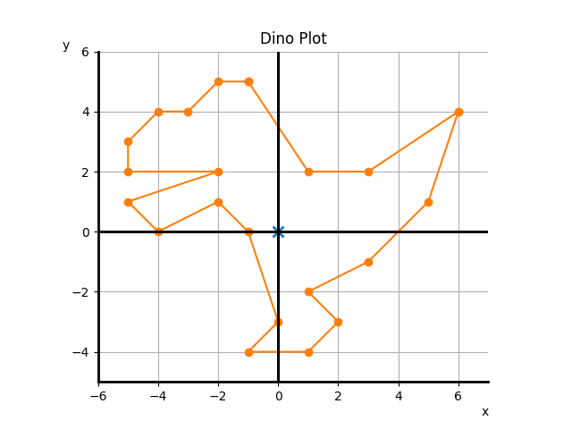

# Vector Drawing

This repo represents a little playground for drawing with 2D vectors, using the matplotlib Python library.

Presently, we have with us one lil dino

## Our Dino Pal, plotted with 2D Vectors

